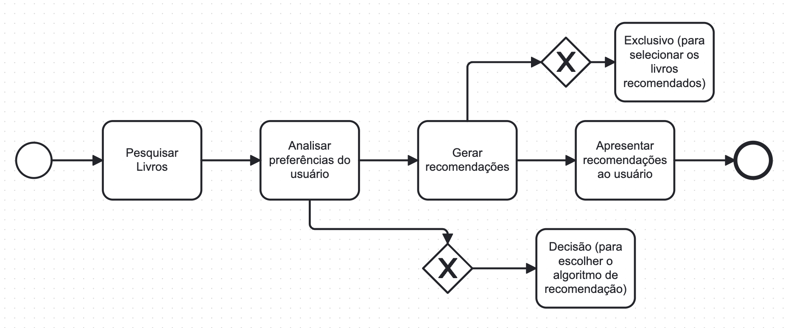
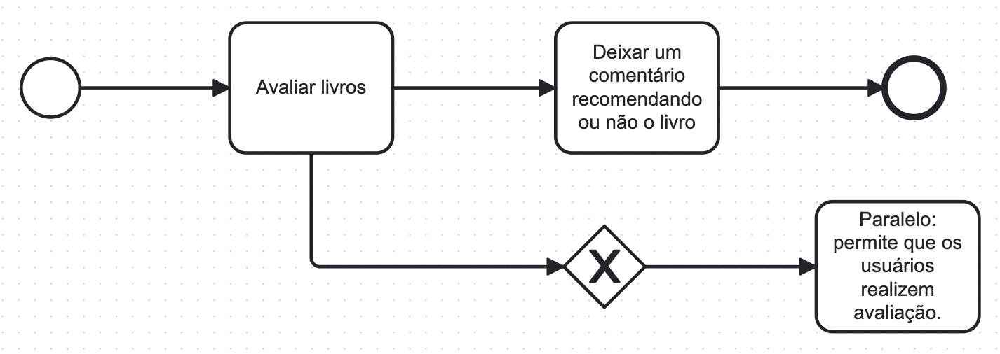

# Especificações do Projeto

## Personas

| Persona                    | Idade | Profissão               | Descrição                                                                                                     | Motivação                                                                                                                                                                                                                                                                                                                                                         | Necessidades                                                                                                                                                                                                                                                                                                                                                                                                                                 |
|----------------------------|-------|-------------------------|---------------------------------------------------------------------------------------------------------------|-----------------------------------------------------------------------------------------------------------------------------------------------------------------------------------------------------------------------------------------------------------------------------------------------------------------------------------------------------------------------------------------------------------------------------------|--------------------------------------------------------------------------------------------------------------------------------------------------------------------------------------------------------------------------------------------------------------------------------------------------------------------------------------------------------------------------------------------------------------------------------------------|
| **Joana Oliveira Dos Santos** | 27    | Dona de escola de artes marciais, formada em Educação Física | Joana é uma pessoa entusiasmada e positiva, apaixonada por leituras que estimulam sua mente e ajudam a aprimorar seus exercícios físicos.                                | Joana está interessada em compartilhar resenhas sobre livros de autoajuda e instruções para melhorar suas técnicas em artes marciais, especialmente com seus alunos.                                                                                                                                                                                                                                                                                                                                                         | Joana busca uma forma rápida de selecionar seus livros favoritos e filtrar por gênero, principalmente relacionados a esportes e autoajuda.                                                                                                                                                                                                                                                                                                                                                             |
| **Bernardo Silva Prado**       | 35    | Programador Full-Stack  | Bernardo é um programador experiente, focado no desenvolvimento de software web e mobile. Ele é o criador do APP BookFlows.                                              | Bernardo deseja contribuir para o desenvolvimento de ferramentas que auxiliem na pesquisa e análise de informações tecnológicas, melhorando a qualidade das resenhas e avaliações de livros na plataforma.                                                                                                                                                                                                                                                                                      | Bernardo necessita acessar resenhas e avaliações de outros profissionais de tecnologia, usar um sistema de busca robusto e filtros específicos para o nicho tecnológico, e encontrar livros relevantes de forma rápida e eficiente.                                                                                                                                                                                                                                                               |
| **Gabriela Costa**              | 22    | Estudante de Letras     | Gabriela é uma leitora apaixonada, especialmente por literatura brasileira e estrangeira, focando em poesia e teoria literária.                                              | Gabriela busca aprofundar seus conhecimentos literários, encontrar novas leituras para seus estudos e descobrir autores desconhecidos.                                                                                                                                                                                                                                                                                                                                                        | Gabriela precisa criar listas de leitura personalizadas, acessar informações detalhadas sobre os livros, conectar-se com outros estudantes de Letras para trocar ideias e receber dicas de leitura personalizadas com base em seus gostos e histórico de leitura.                                                                                                                                                                                                                       |

## Histórias de Usuários

Com base na análise das personas foram identificadas as seguintes histórias de usuários:

|EU COMO... `PERSONA`| QUERO/DESEJO ... `O QUE` |PARA ... `PORQUE`                 |
|--------------------|------------------------------------|----------------------------------------|
|Joana Oliveira dos Santos (Usuária)| Aplicativo de livros para compartilhar e uso próprio| Aplicativo para facilitar o compartilhamento de livros com alunos e para uso próprio de leitura.|
|Bernardo Silva Prado (Desenvolvedor)| Um aplicativo intuitivo e para melhorar a qualidade das resenhas e avaliações de livros, tornando mais fácil para os usuários encontrarem os livros que procuram| Para economizar tempo e dinheiro caso, facilitando a procura e avaliações.|
|Gabriela Costa (Usuária)| Uma ferramenta para personalizar livros por gênero, autor ou tema. Uma área de comentários para poder interagir com outros leitores| Para facilitar achar livros que despertem interesse nos leitores e troca de conhecimentos.|

## Modelagem do Processo de Negócio 

### Análise da Situação Atual

Atualmente, a busca por referências sobre livros muitas vezes é uma experiência fragmentada e desorganizada para os usuários. Problemas como falta de personalização na seleção de livros, dificuldade em interagir com outros leitores e falta de recursos para acompanhar a leitura podem desmotivar os usuários e impactar negativamente a experiência do usuário.

### Descrição Geral da Proposta

O BookFlows propõe uma solução abrangente para otimizar a busca por referências sobre livros, alinhando-se aos objetivos do negócio de proporcionar uma experiência de leitura envolvente e personalizada. A proposta visa melhorar a interação entre os usuários, facilitar a descoberta de novos livros e oferecer recursos avançados para acompanhar e organizar a leitura. As oportunidades de melhoria incluem a implementação de recursos de recomendação mais inteligentes, aprimoramento da interação social e a introdução de ferramentas para monitorar e gerenciar o progresso da leitura.

### Processo 1 – Descoberta de Livros

### Processo 2 – Interação Social

## Indicadores de Desempenho

| Indicador de Desempenho        | Meta                                          |
|--------------------------------|-----------------------------------------------|
| Taxa de Satisfação do Usuário | Alcançar 90% até o final do próximo trimestre |
| Taxa de Engajamento            | Aumentar em 20% nos próximos seis meses       |
| Taxa de Conversão              | Aumentar em 15% até o final do ano            |
| Tempo Médio de Permanência     | Aumentar para 30 minutos até o final do próximo semestre |
| Taxa de Retenção de Usuários   | Manter em 80% ou superior ao longo do próximo ano    |

## Requisitos

As tabelas que se seguem apresentam os requisitos funcionais e não funcionais que detalham o escopo do projeto. Para determinar a prioridade de requisitos, aplicar uma técnica de priorização de requisitos e detalhar como a técnica foi aplicada.

### Requisitos Funcionais

|ID    |Descrição do Requisito| Prioridade |
|------|----------------------|------------|
|RF-001| O aplicativo deve permitir o cadastro de usuários. |ALTA|
|RF-002| O aplicativo deve permitir o login de clientes. |ALTA|
|RF-003| O aplicativo deve apresentar uma lista com os livros. |ALTA|
|RF-004| O aplicativo deve permitir que o usuário altere os seus dados. |ALTA|
|RF-005| O aplicativo deve apresentar uma barra de pesquisa. |ALTA|
|RF-006| O aplicativo deve ter avaliação e comentários. |ALTA|
|RF-007| O aplicativo deve ter opção de filtro. |MÉDIA|
|RF-008| Permitir que o usuário altere a avaliação. | MÉDIA |

### Requisitos não Funcionais

A tabela a seguir apresenta os requisitos não funcionais que o projeto deverá atender.

|ID  | Descrição do Requisito  |Prioridade |
|----|-------------------------|----|
|RNF-001| A aplicação deve estar disponível 24 horas por dia, todos os dias da semana  | ALTA ||ALTA|
|RNF-002| A aplicação deve ter bom nível de contraste entre os elementos da tela em conformidade |MÉDIA|
|RNF-003| O aplicativo deve processar requisições do usuário em no máximo 3s |BAIXA|
|RNF-004| A aplicação deve ser compatível com um dispositivos móvel.| MÉDIA |
|RNF-005| A aplicação deve ter uma linguagem simples e de fácil entendimento | ALTA |
|RNF-006| A aplicação deve ter uma boa navegabilidade e usabilidade, facilitando a experiência do usuário | ALTA |
|RNF-007| Por se tratar de uma aplicação com abrangência nacional, a mesma deve comportar grandes acessos simultâneos | ALTA |

## Restrições

O projeto está restrito pelos itens apresentados na tabela a seguir.

|ID| Restrição                                             |
|--|-------------------------------------------------------|
|01| O projeto deverá ser entregue até o final do semestre. 
|02| Não será usada validação de dados back-end em uma linguagem separada (C#, JAVA, Python).        
|03| Será desenvolvido com a ferramenta React Native.       
|04| O projeto final para uso de fins pessoais não é permitido.
|05| Não será utilizada geração de código automáticos, gerados por IAs.     
|06|	O projeto deve ser compatível com navegadores antigos (IE11, Edge Legacy).
|07| O projeto deve ser testado em diferentes dispositivos (smartphones, tablets, desktops).
|08| O projeto deve ser aprovado pelos desenvolvedores antes de ser lançado.
|09| O projeto deve ser fácil de usar e entender.
|10| O projeto deve ser escalável para acomodar o crescimento futuro.

# Matriz de Rastreabilidade

| Requisito                       | Processo Associado                   | Indicador de Desempenho Relacionado          |
|---------------------------------|--------------------------------------|---------------------------------------------|
| Tela de Login                   | -                                    | -                                           |
| Perfil do Usuário               | -                                    | -                                           |
| Lista de Livros                 | -                                    | -                                           |
| Barra de Pesquisa               | -                                    | -                                           |
| Sugestões por Filtragem         | Processo 1 - Descoberta de Livros   | Taxa de Conversão                           |
| Comentários e Avaliações        | Processo 2 - Interação Social       | Taxa de Engajamento, Taxa de Retenção       |
| Filtros                         | -                                    | -                                           |

# Gerenciamento de Projeto

De acordo com o PMBoK v6 as dez áreas que constituem os pilares para gerenciar projetos, e que caracterizam a multidisciplinaridade envolvida, são: Integração, Escopo, Cronograma (Tempo), Custos, Qualidade, Recursos, Comunicações, Riscos, Aquisições, Partes Interessadas. Para desenvolver projetos um profissional deve se preocupar em gerenciar todas essas dez áreas. Elas se complementam e se relacionam, de tal forma que não se deve apenas examinar uma área de forma estanque. É preciso considerar, por exemplo, que as áreas de Escopo, Cronograma e Custos estão muito relacionadas. Assim, se eu amplio o escopo de um projeto eu posso afetar seu cronograma e seus custos.

## Gerenciamento de Tempo

Com diagramas bem organizados que permitem gerenciar o tempo nos projetos, o gerente de projetos agenda e coordena tarefas dentro de um projeto para estimar o tempo necessário de conclusão.

O gráfico de Gantt ou diagrama de Gantt também é uma ferramenta visual utilizada para controlar e gerenciar o cronograma de atividades de um projeto. Com ele, é possível listar tudo que precisa ser feito para colocar o projeto em prática, dividir em atividades e estimar o tempo necessário para executá-las.

## Gerenciamento de Equipe

### Equipe de Desenvolvimento:

1. **Carlos Henrique Vilar de Almeida Malta:** Responsável por coordenar todas as atividades relacionadas ao desenvolvimento do aplicativo. Deve garantir que o projeto siga dentro do cronograma estabelecido, resolver possíveis conflitos e manter a equipe motivada.

2. **Fulvius Wolfgang Faria Fonseca Macedo:** Encarregado de criar a interface do usuário do aplicativo, garantindo uma experiência de usuário intuitiva e atraente.

3. **João Leonardo Ohasi Amorim:** Responsável pela implementação das funcionalidades do aplicativo, como a integração com APIs externas e a manipulação de dados do usuário.

4. **Lucas Marlon Oliveira De Jesus:** Encarregado de projetar a interface do usuário e garantir uma experiência de usuário consistente e agradável.

### Equipe de Testes:

1. **Thamara Machado Rocha:** Responsável por testar o aplicativo em todas as suas funcionalidades e relatar quaisquer bugs ou problemas encontrados.

2. **Mirella Gabriela Silva Bonutty De Freitas:** Encarregada de realizar testes de usabilidade e identificar possíveis melhorias na experiência do usuário.

### Comunicação e Gestão de Tarefas:

- Utilização de ferramentas de comunicação como Discord ou Microsoft Teams para facilitar a comunicação entre os membros da equipe.
- Utilização de ferramentas de gerenciamento de projetos como Trello para atribuir tarefas, acompanhar o progresso e garantir que os prazos sejam cumpridos.
- Realização de reuniões regulares de equipe para alinhamento de objetivos, revisão de progresso e resolução de problemas.

## Gestão de Orçamento

1. **Desenvolvimento de Software:** R$50.000,00
   
2. **Hospedagem e Infraestrutura:** R$10.000,00

3. **Marketing e Publicidade:** R$20.000,00

4. **Suporte Técnico:** R$15.000,00

5. **Licenças e Ferramentas de Desenvolvimento:** R$5.000,00

### Controle de Orçamento:

- **Orçamento Total:** R$100.000,00

